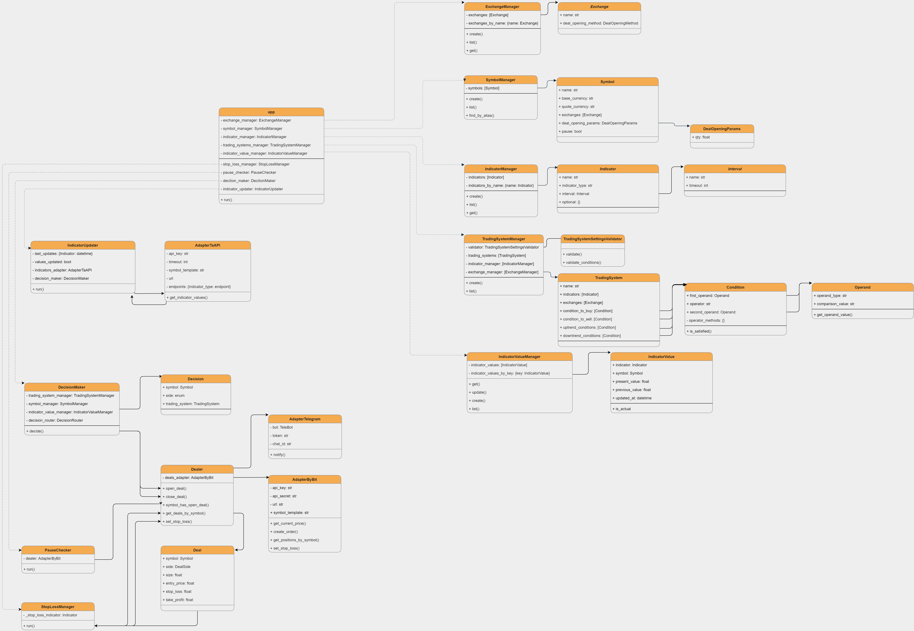

# Scrooge - торговый бот

> ⚠️ Бот не предназначен для торговли на реальных счетах.
>
> Используйте только для проверки торговых гипотез на тестовых аккаунтах.

## Введение

Бот предназначен для проверки торговых гипотез на криптовалютных рынках.

Умеет следить за монетами, которые торгуются на [binance], открывать сделки
на [bybit] и отправлять уведомления в telegram.

> ⚠️ Бот не создавался для реальной торговли, только для тестирования торговых
> гипотез на реальных данных, но на тестовых аккаунтах.
>
> Поэтому выбран [bybit], там есть возможность создать демо-аккаунт и торговать
> виртуальными монетами.

[binance]: https://www.binance.com

[bybit]: https://www.bybit.com/

## Как пользоваться

Основная задача бота — помогать открывать сделки. В зависимости от торговой
площадки, он присылает уведомление в нужный момент или открывает сделку.

Чтобы бот понял, когда нужно открыть сделку, нужно описать условия открытия
сделки. Для этого используются индикаторы технического
анализа: [скользящая средняя], [Momentum], [RSI] и другие.

[скользящая средняя]: https://ru.wikipedia.org/wiki/Скользящая_средняя

[Momentum]: https://ru.wikipedia.org/wiki/Моментум

[RSI]: https://ru.wikipedia.org/wiki/Индекс_относительной_силы

Бот умеет работать с индикаторами тремя способами:

1. Сравнивать текущее (или предыдущее) значение индикатора с конкретным
   значением
   > Продавать, когда RSI больше 70 или покупать, когда RSI меньше 30.
2. Сравнивать текущее значение индикатора с предыдущим
   > Покупать, когда ADX растет (т.е. текущее значение ADX больше предыдущего
   > значения ADX) или продавать, когда ADX падает (текущее значение ADX меньше,
   > чем предыдущее значение ADX).
3. Сравнивать текущие (или предыдущие) значения двух разных индикаторов
   > Покупать, когда 4-дневная скользящая средняя больше, чем 9-дневная
   > скользящая средняя или продавать, когда 4-дневная скользящая средняя
   > меньше 9-дневной скользящей средней.

Можно использовать сложные условия и проверять значения нескольких индикаторов.
> Открыть сделку, когда ADX растет и 4-дневная скользящая средняя больше
> 9-дневной скользящей средней.

Еще бот умеет закрывать сделки (тоже по значениям индикаторов), выставлять
стоп-лосс и тейк-профит, двигать стоп-лосс по Parabolic SAR.

В разделе "как настроить" описано подробнее, какие индикаторы поддерживаются,
как настраивать условия открытия сделки и выбирать режим работы бота.

## Как настроить

### settings.json

Блок **exchanges** содержит информацию о биржах и методах открытия сделок.

```json5
{
  "exchanges": [
    {
      "name": "ByBit",
      // если open_deal, бот будет открывать сделки, если send_message - 
      // отправлять сообщения
      "deal_opening_method": "open_deal"
    }
  ]
}
```

Блок **symbols** содержит настройки монет, за которыми нужно следить

```json5
{
  "symbols": [
    {
      // базовая валюта
      "base_currency": "BTC",
      // валюта котировки
      "quote_currency": "USDT",
      "exchanges": [
        // список бирж для монеты
        "bybit"
      ],
      "deal_opening_params": {
        // размер сделки
        "qty": 0.001
      }
    }
  ]
}
```

Блок **trading_system_settings** содержит настройки, по которым будут
открываться и закрываться сделки

```json5
{
  // название торговой системы
  "name": "Trends+4MA+9MA",
  "settings": {
    // настройки индикаторов
    "indicators": [
      {
        // имя
        "name": "ADX_1d",
        // тип индикатора 
        "indicator_type": "ADX",
        // интервал 
        "interval": "1d",
        // опциональные параметры
        "optional": {}
      },
      {
        "name": "MovingAverage_1h_period4",
        "indicator_type": "MovingAverage",
        "interval": "1h",
        "optional": {
          "period": 4
        }
      },
      {
        "name": "MovingAverage_1h_period9",
        "indicator_type": "MovingAverage",
        "interval": "1h",
        "optional": {
          "period": 9
        }
      },
    ],
    // список бирж, для которых будет работать торговая система
    "exchanges": [
      "ByBit",
    ],
    // условия для покупки
    "conditions_to_buy": [
      // первое условие
      {
        "first_operand": {
          // что сравнивать (значение индикатора или число)
          // Так же может быть NUMBER, тогда value должно быть числом
          "operand_type": "INDICATOR_VALUE",
          // показывает, какое нужно сравнивать значение. Может быть previous_value
          "value": "MovingAverage_1h_period4.present_value"
        },
        // оператор сравнения. Может быть так же < или =
        "operator": ">",
        // с чем сравнивать (тоже может быть значением индикатора или числом)
        "second_operand": {
          "operand_type": "INDICATOR_VALUE",
          "value": "MovingAverage_1h_period9.present_value"
        },
        // если true - значит нужно закрыть сделку, когда условие перестает выполняться
        "is_close_condition": true
      },
      // второе условие. Чтобы сделка была открыта, должны выполниться оба
      {
        "first_operand": {
          "operand_type": "INDICATOR_VALUE",
          "value": "ADX_1d.present_value"
        },
        "operator": ">",
        "second_operand": {
          "operand_type": "INDICATOR_VALUE",
          "value": "ADX_1d.previous_value"
        },
        "is_close_condition": false
      },
    ],
    // условия для продажи. Аналогично условиям для покупки, только сделка 
    // будет открыта в другом направлении
    "conditions_to_sell": [
      {
        "first_operand": {
          "operand_type": "INDICATOR_VALUE",
          "value": "MovingAverage_1h_period9.present_value"
        },
        "operator": ">",
        "second_operand": {
          "operand_type": "INDICATOR_VALUE",
          "value": "MovingAverage_1h_period4.present_value"
        },
        "is_close_condition": true
      },
      {
        "first_operand": {
          "operand_type": "INDICATOR_VALUE",
          "value": "ADX_1d.present_value"
        },
        "operator": "<",
        "second_operand": {
          "operand_type": "INDICATOR_VALUE",
          "value": "ADX_1d.previous_value"
        },
        "is_close_condition": false
      },
    ]
  }
}
```

### .env

Чтобы торговый бот мог присылать сообщения в telegram, нужно создать
telegram-бота. Сделать это можно по [инструкции][create-tg-bot].

Токен бота и chat_id нужно добавить в соответствующие переменные в `.env`
(`TELEGRAM_TOKEN`, `TELEGRAM_CHAT_ID`)

Чтобы получать информацию об индикаторах, нужно получить API-ключ в [taapi].
Ключ нужно добавить в переменную `TA_API_KEY`

Если ключ бесплатный - taapi ограничивают запросы не более 1 запроса в 15
секунд. В этом случае `TA_API_TIMEOUT = 15`

Если бот должен открывать сделки, нужно зарегистрировать тестовый аккаунт
на [bybit] и заполнить `BY_BIT_API_KEY` и `BY_BIT_API_SECRET`.

[create-tg-bot]: https://tlgrm.ru/docs/bots#kak-sozdat-bota

[taapi]: https://taapi.io/my-account/

[bybit]: https://testnet.bybit.com

## Архитектура

Схема взаимодействия классов



## TODO

- [ ] Дописать тесты
- [ ] Добавить хранилище для настроек торговых систем
- [ ] Добавить возможность редактировать и создавать торговые системы через
  telegram
- [ ] Перевести README на английский
